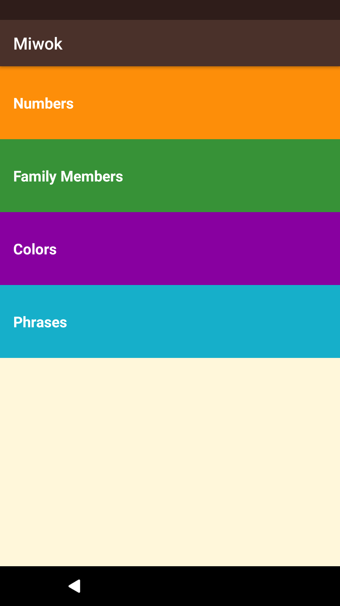
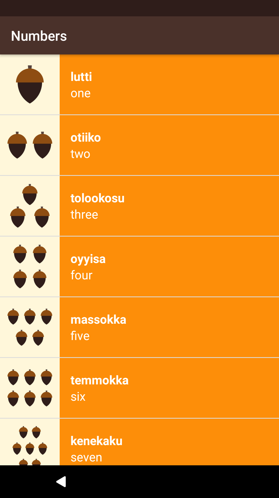
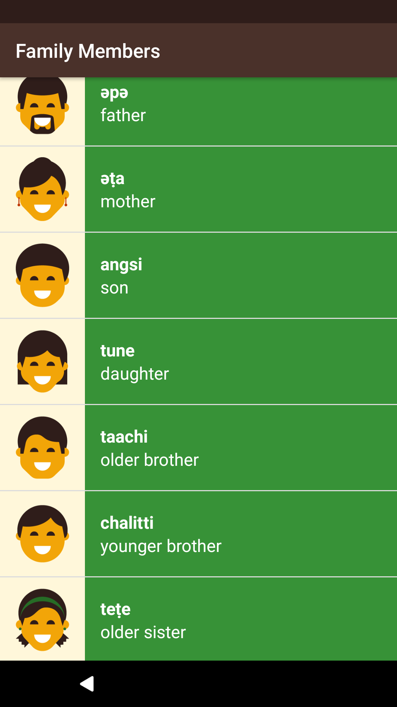

Miwok App
===================================

<b>Android Application built under Udacity Course on Android - MultiScreen Apps.</b>

Application displays the use of Custom Adapters which can be used with ListViews
to create dynamic lists containing multiple Views.

Main Screen using LinearLayout

Further Activities using ListViews and inflated using WordAdaptor.java
 

 

